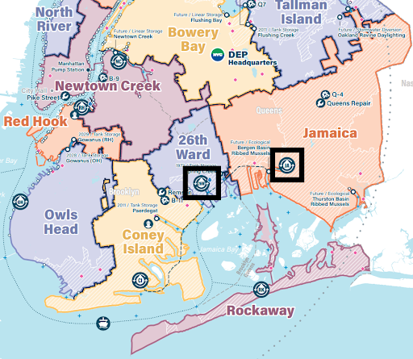

A surface-level dive into the reasons behind the exceptions and outliers within the previous five PCA biplots revealed that in March 2002, a severe drought occurred in 17% of the contiguous United States (National Centers for Environmental Information, 2002). Droughts generally cause increased salt density in ocean water and estuaries due to decreases in freshwater river discharge (U.S. Environmental Protection Agency, 2025). When looking at the five PCA biplots generated in this project, the point for 2002 is located closest to the endpoint of the salinity eigenvector than to any other feature. This would require further analysis of all stations to confirm, but it is a plausible explanation for its positioning.

Alexander’s (2018) research adds to our understanding of the biplots above with a timeline of policy and wastewater treatment changes implemented in Jamaica Bay. Between 2010 and 2015, two different wastewater treatment plants (WWTP) experienced significant upgrades to their biological nitrogen removal technologies: the 26th Ward WWTP and the Jamaica WWTP (Alexander, 2018).

Biological nitrogen removal (BNR) technology was introduced to the 26th Ward in 2010, and installation was completed in 2011 (Alexander, 2018). In the Jamaica WWTP, installations of biological nitrogen removal technology began in 2012 and were completed by the beginning of 2015 (Alexander, 2018). Both of these improvements to wastewater treatment align with the clusters visualized in the PCA biplots above. Station J7 is located closest to the Jamaica WWTP, and it exhibits the clearest cluster beginning in 2015. This point of change could be attributed to the BNR installments and their completion at the Jamaica WWTP. J3 is located closest to the 26th Ward WWTP, and shows cluster 1 beginning in the year 2013. The improvements in the 26th Ward, which preceded those in the Jamaica WWTP, could explain the disconnected years in cluster 1 for stations J5 and J1. Further research would be needed to prove statistical significance in the influence of these WWTPs on the water quality analysis at these stations, in addition to analyses at other stations not included in this study. Additional research would also be needed to assess the influences of these treatment plants, along with other treatment plants across the coast of New York City, located in and outside Jamaica Bay.
