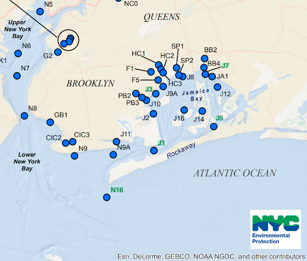

```{=html}
<div class="method-flow">
  <span class="step">NYC Harbor survey data, 1995&ndash;2024</span>
  <span class="arrow">&rarr;</span>
  <span class="step">Filter to summer months (Jun&ndash;Sep)</span>
  <span class="arrow">&rarr;</span>
  <span class="step">Split into 5 station datasets</span>
  <span class="arrow">&rarr;</span>
  <span class="step">Log-transform skewed variables, scale</span>
  <span class="arrow">&rarr;</span>
  <span class="step">PCA, 10 variables</span>
  <span class="arrow">&rarr;</span>
  <span class="step">k-means, k = 3</span>
</div>
```

The New York City Harbor Water Quality dataset was used for this analysis (NYC Open Data, n.d.) The
data between 1995 and 2024 was initially cleaned by Danielle Alexander and Mojgan Zamani (2026).
Once received, the data was parsed for duplicate sampling, discrepancies in feature names, and
string-to-datetime conversions on Python using the pandas library. The data was filtered to view
values including and after 1995, then filtered for summer months (specifically, June to September). Following data exploration methods, since the purpose of this project was to replicate Alexander’s study on individual stations within Jamaica Bay without temporal changepoint analysis, the same feature variables were filtered into the dataset for analysis:

* Dissolved Oxygen (mg/L)
* Water temperature (Celsius)
* Salinity (PSU)
* pH
* Secchi disk depth (meters)
* Chlorophyll a (ug/L)
* Total phosphorus (mg/L)
* Ammonium (mg/L)
* Nitrate/Nitrite (mg/L)
* Total Kjeldahl nitrogen (mg/L)

Mean values for each year’s summer were calculated for each relevant variable as a representative
value. Finally, the dataset was split into separate datasets, each including data for one station.
Five water quality assessment stations were studied in this analysis, generating five datasets.
These stations were selected based on geographic locations and distance from each other, along with
insights from Alexander’s work. The following stations are listed from most inland to farthest into the ocean:

* J7
* J3
* J5
* J1
* N16



In Alexander’s (2018) work, the following stations clustered differently before and after 2008: J3,  J2, and J5. Since J2 showed the same clustering differences as J3, and J3 was further inland than J2, J3 was chosen for this project. N16 was included here to verify whether it could act as a relative control variable compared to other stations, as it is geographically furthest from the bay. Similarly, J7 was included since it was the most inland station available for analysis. Once the data had been split by station, each resulting dataset was normalized. After visualizing the distributions of each feature using Python’s matplotlib package, the following variables were identified as left-skewed and normalized via logarithmic transformations, in accordance with Alexander’s (2018) methods:

* Dissolved oxygen
* Secchi disk depth
* Chlorophyll a
* Total phosphorus
* Ammonium
* Nitrate/Nitrite
* Total Kjeldahl Nitrogen

Scikit-learn libraries in Python were used to scale the data. A principal component analysis was run on all of these variables to visualize the clustering of years, with one PCA per station chosen. In order to accurately run PCA,
the data was checked to ensure no missing values. A missing value was found for total Kjeldahl nitrogen in each dataset, so 1995 was dropped as a year of analysis. This resulted in the final study including the years 1996 to 2024. Finally, PCA was initialized and run on the datasets, once again, using scikit-learn libraries. In order to generate visualizations of the PCA, the matplotlib libraries were leveraged. After PCA, k-means clustering was then applied to the PCA biplot to reveal patterns within the data. Three clusters were determined as the ideal number of clusters in this analysis after assessing inertia plots to generate useful results while minimizing overfitting of the model.
